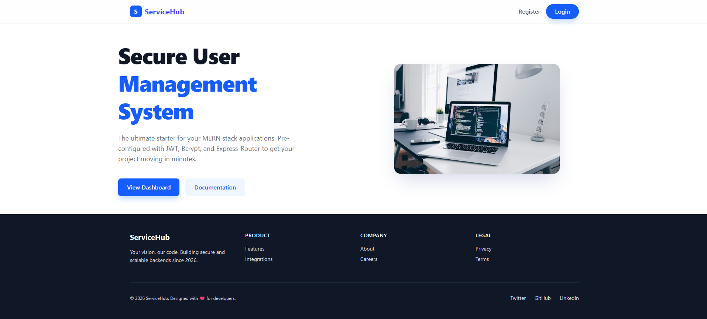

# Syntecxhub User Management System



## 📋 Table of Contents

- [Overview](#overview)
- [Features](#features)
- [Tech Stack](#tech-stack)
- [Prerequisites](#prerequisites)
- [Installation Guide](#installation-guide)
- [Project Structure](#project-structure)
- [Configuration](#configuration)
- [Running the Application](#running-the-application)
- [API Documentation](#api-documentation)
- [Development Workflow](#development-workflow)
- [Troubleshooting](#troubleshooting)
- [Contributing](#contributing)
- [License](#license)

---

## 🎯 Overview

Syntecxhub User Management System is a comprehensive full-stack application designed to manage user authentication, registration, and profile management. Built with modern technologies, it provides a robust and scalable solution for user-related operations.

---

## ✨ Features

- ✅ **User Authentication** - Secure login and logout functionality
- ✅ **User Registration** - Easy onboarding with validation
- ✅ **Profile Management** - Edit and manage user profiles
- ✅ **Dashboard** - Intuitive user dashboard
- ✅ **Navigation** - Responsive and fixed navigation bar
- ✅ **RESTful APIs** - Well-structured backend APIs
- ✅ **Error Handling** - Comprehensive error management
- ✅ **Responsive Design** - Mobile-friendly interface

---

## 🛠️ Tech Stack

### Frontend
- **React 18+** - UI library
- **Vite** - Fast build tool and dev server
- **JavaScript** - Primary language
- **CSS/TailwindCSS** - Styling (optional)
- **Axios** - HTTP client

### Backend
- **Node.js** - Runtime environment
- **Express.js** - Web framework
- **MongoDB/Database** - Data persistence
- **JWT** - Authentication tokens
- **Bcryptjs** - Password hashing

---

## 📋 Prerequisites

Before you begin, ensure you have the following installed on your system:

1. **Node.js** (v16.0.0 or higher)
   - Download from: https://nodejs.org/
   - Verify installation: `node --version`

2. **npm** (v8.0.0 or higher)
   - Usually comes with Node.js
   - Verify installation: `npm --version`

3. **Git** (v2.0.0 or higher)
   - Download from: https://git-scm.com/
   - Verify installation: `git --version`

4. **Code Editor** (Recommended: VS Code)
   - Download from: https://code.visualstudio.com/

5. **Database** (Optional, depending on backend setup)
   - MongoDB Atlas account or local MongoDB installation
   - Download MongoDB: https://www.mongodb.com/try/download/community

---

## 🚀 Installation Guide

### Step 1: Clone the Repository

```bash
git clone https://github.com/Shahriyar-Rahim/Syntecxhub_User_Management_System.git
cd Syntecxhub_User_Management_System
```

### Step 2: Install Dependencies for Frontend

```bash
# Navigate to frontend directory
cd frontend

# Install all dependencies
npm install

# Verify installation
npm list
```

### Step 3: Install Dependencies for Backend

```bash
# Go back to root directory
cd ..

# Navigate to backend directory
cd backend

# Install all dependencies
npm install

# Verify installation
npm list
```

### Step 4: Environment Variables Setup

#### Backend Environment Variables

Create a `.env` file in the `backend` directory:

```env
PORT=5000
NODE_ENV=development
DATABASE_URL=mongodb://localhost:27017/syntecxhub
JWT_SECRET=your_super_secret_jwt_key_here
JWT_EXPIRE=7d
CORS_ORIGIN=http://localhost:5173
```

#### Frontend Environment Variables

Create a `.env` file in the `frontend` directory:

```env
VITE_API_BASE_URL=http://localhost:5000/api
VITE_API_TIMEOUT=10000
```

### Step 5: Database Setup (if using MongoDB)

#### Option A: Local MongoDB
```bash
# Start MongoDB service (Windows)
mongod

# Start MongoDB service (Mac/Linux)
brew services start mongodb-community
```

#### Option B: MongoDB Atlas (Cloud)
1. Create an account at https://www.mongodb.com/cloud/atlas
2. Create a cluster and get your connection string
3. Update `DATABASE_URL` in backend `.env` file

---

## 📁 Project Structure

```
Syntecxhub_User_Management_System/
├── frontend/                    # React Vite application
│   ├── public/                 # Static files
│   ├── src/
│   │   ├── components/         # Reusable components
│   │   ├── pages/              # Page components
│   │   ├── services/           # API services
│   │   ├── hooks/              # Custom React hooks
│   │   ├── utils/              # Utility functions
│   │   ├── styles/             # CSS files
│   │   ├── App.jsx             # Main App component
│   │   └── main.jsx            # Entry point
│   ├── package.json
│   ├── vite.config.js
│   └── .env                    # Environment variables
│
├── backend/                     # Node.js/Express application
│   ├── models/                 # Database models
│   ├── routes/                 # API routes
│   ├── controllers/            # Route controllers
│   ├── middleware/             # Custom middleware
│   ├── config/                 # Configuration files
│   ├── utils/                  # Utility functions
│   ├── server.js               # Server entry point
│   ├── package.json
│   └── .env                    # Environment variables
│
├── README.md                    # Project documentation
├── .gitignore
└── package.json                # Root package.json (optional)
```

---

## ⚙️ Configuration

### Backend Configuration

1. **Server Configuration** (`backend/config/server.js`)
   - Define port and environment settings
   - Configure CORS options

2. **Database Configuration** (`backend/config/database.js`)
   - Set MongoDB connection string
   - Configure connection pooling

3. **Authentication Configuration** (`backend/config/auth.js`)
   - JWT secret and expiration
   - Password hashing rounds

### Frontend Configuration

1. **API Client Setup** (`frontend/src/services/api.js`)
   ```javascript
   import axios from 'axios';
   
   const API = axios.create({
     baseURL: import.meta.env.VITE_API_BASE_URL,
     timeout: import.meta.env.VITE_API_TIMEOUT,
   });
   
   export default API;
   ```

2. **Router Configuration** (`frontend/src/App.jsx`)
   - Define routes and page mappings
   - Set up protected routes

---

## ▶️ Running the Application

### Step 1: Start the Backend Server

```bash
# Navigate to backend directory
cd backend

# Development mode (with auto-reload)
npm run dev

# OR Production mode
npm start

# Expected output:
# Server running on http://localhost:5000
```

### Step 2: Start the Frontend Development Server

Open a new terminal window:

```bash
# Navigate to frontend directory
cd frontend

# Start development server
npm run dev

# Expected output:
# VITE v4.x.x  ready in xxx ms
# ➜  Local:   http://localhost:5173/
```

### Step 3: Access the Application

Open your browser and navigate to:
```
http://localhost:5173
```

---

## 📡 API Documentation

### Authentication Endpoints

#### Register User
```http
POST /api/auth/register
Content-Type: application/json

{
  "name": "John Doe",
  "email": "john@example.com",
  "password": "secure_password_123"
}

Response: 201 Created
{
  "success": true,
  "message": "User registered successfully",
  "user": {
    "id": "user_id",
    "name": "John Doe",
    "email": "john@example.com"
  },
  "token": "jwt_token_here"
}
```

#### Login User
```http
POST /api/auth/login
Content-Type: application/json

{
  "email": "john@example.com",
  "password": "secure_password_123"
}

Response: 200 OK
{
  "success": true,
  "message": "Login successful",
  "user": {
    "id": "user_id",
    "name": "John Doe",
    "email": "john@example.com"
  },
  "token": "jwt_token_here"
}
```

#### Logout User
```http
POST /api/auth/logout
Authorization: Bearer jwt_token_here

Response: 200 OK
{
  "success": true,
  "message": "Logged out successfully"
}
```

### User Endpoints

#### Get User Profile
```http
GET /api/users/profile
Authorization: Bearer jwt_token_here

Response: 200 OK
{
  "success": true,
  "user": {
    "id": "user_id",
    "name": "John Doe",
    "email": "john@example.com",
    "createdAt": "2026-04-23T00:00:00Z"
  }
}
```

#### Update User Profile
```http
PUT /api/users/profile
Authorization: Bearer jwt_token_here
Content-Type: application/json

{
  "name": "Jane Doe",
  "email": "jane@example.com"
}

Response: 200 OK
{
  "success": true,
  "message": "Profile updated successfully",
  "user": { ... }
}
```

---

## 👨‍💻 Development Workflow

### Available npm Scripts

#### Frontend Scripts
```bash
# Development mode with hot reload
npm run dev

# Build for production
npm run build

# Preview production build
npm run preview

# Run ESLint
npm run lint
```

#### Backend Scripts
```bash
# Development mode with nodemon
npm run dev

# Production mode
npm start

# Run tests
npm test
```

### Git Workflow

```bash
# Create a new feature branch
git checkout -b feature/feature-name

# Make changes and commit
git add .
git commit -m "feat: add new feature"

# Push to remote
git push origin feature/feature-name

# Create a Pull Request on GitHub
```

---

## 🐛 Troubleshooting

### Issue: Port Already in Use

**Error:** `EADDRINUSE: address already in use :::5000`

**Solution:**
```bash
# Find process using port 5000 (Linux/Mac)
lsof -i :5000

# Kill the process
kill -9 <PID>

# On Windows, use:
netstat -ano | findstr :5000
taskkill /PID <PID> /F
```

### Issue: CORS Errors

**Error:** `Access to XMLHttpRequest blocked by CORS policy`

**Solution:**
1. Check backend `.env` file has correct `CORS_ORIGIN`
2. Verify frontend `VITE_API_BASE_URL` matches backend URL
3. Restart both servers

### Issue: Database Connection Failed

**Error:** `MongooseError: Cannot connect to MongoDB`

**Solution:**
1. Verify MongoDB is running
2. Check `DATABASE_URL` in `.env` file
3. Verify database credentials
4. Check firewall settings

### Issue: Dependencies Not Installing

**Error:** `npm ERR! code ERESOLVE`

**Solution:**
```bash
# Clear npm cache
npm cache clean --force

# Delete node_modules and package-lock.json
rm -rf node_modules package-lock.json

# Reinstall dependencies
npm install

# If still failing, use legacy peer deps
npm install --legacy-peer-deps
```

### Issue: Node Version Compatibility

**Error:** `Node version does not meet requirements`

**Solution:**
```bash
# Check Node version
node --version

# Install Node Version Manager (nvm) for easy switching
# https://github.com/nvm-sh/nvm

nvm install 18.0.0
nvm use 18.0.0
```

---

## 📝 Common Tasks

### Adding a New API Endpoint

1. Create controller in `backend/controllers/`
2. Create route in `backend/routes/`
3. Add middleware if needed in `backend/middleware/`
4. Test with Postman or curl

### Creating a New Component

1. Create component file in `frontend/src/components/`
2. Import and use in relevant page
3. Style using CSS or TailwindCSS
4. Test in browser

### Deploying to Production

**Frontend (Vercel/Netlify):**
```bash
npm run build
# Deploy the dist/ folder
```

**Backend (Heroku/Railway):**
```bash
git push heroku main
```

---

## 🤝 Contributing

We welcome contributions! Please follow these steps:

1. **Fork** the repository
2. **Create** a feature branch (`git checkout -b feature/AmazingFeature`)
3. **Commit** your changes (`git commit -m 'Add AmazingFeature'`)
4. **Push** to the branch (`git push origin feature/AmazingFeature`)
5. **Open** a Pull Request

### Code Style Guidelines

- Use consistent naming conventions
- Write meaningful commit messages
- Add comments for complex logic
- Follow the existing code structure

---

## 📄 License

This project is licensed under the MIT License - see the LICENSE file for details.

---

## 📧 Support & Contact

For questions, issues, or suggestions:

- **GitHub Issues:** [Create an issue](https://github.com/Shahriyar-Rahim/Syntecxhub_User_Management_System/issues)
- **GitHub Discussions:** [Start a discussion](https://github.com/Shahriyar-Rahim/Syntecxhub_User_Management_System/discussions)
- **Email:** shahriyar.rahim@example.com

---

## 🙌 Acknowledgments

- React and Vite communities
- Express.js framework
- MongoDB documentation
- All contributors and supporters

---

**Last Updated:** April 23, 2026

Made with ❤️ by [Shahriyar-Rahim](https://github.com/Shahriyar-Rahim)
